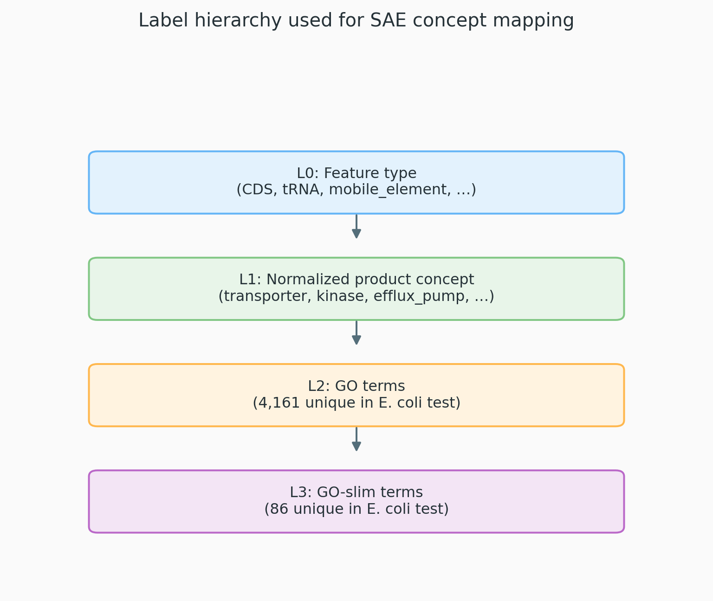

# GO‑Enriched GenBank Annotations Preprocessing for Sequence-level Concept Labels (E. coli test run)

This repo is a small demo showing that **GenBank → GO/GO‑slim** can produce reusable concept labels to support **sequence‑level DNA embedding SAE** concept mapping (and steering experiments such as controlled retrieval).

## Results

- `ecoli_go_enriched_table.csv` — final concept table (E. coli example; no raw DNA stored)
- `stats/` — all the frequency summaries used below
- `figures/` — pipeline overview figure(s)

---

## E. coli snapshot (does it “work”?)

Built from one RefSeq/GenBank genome (E. coli K‑12 MG1655). After QC (removing gene/CDS and gene/RNA duplicates):

- **4,748** features total
- **3,942 (83.0%)** features have ≥1 GO term
- **3,749 (79.0%)** features have ≥1 GO‑slim term
- **4,161** unique GO terms
- **86** unique GO‑slim terms
- Avg labels per labeled feature:
  - **8.28** GO terms / feature (among GO‑labeled)
  - **3.84** GO‑slim terms / feature (among GO‑slim‑labeled)

### Feature types (after QC)

From `stats/feature_type_counts.csv`:

| feature_type   | count |
| -------------- | ----: |
| CDS            |  4315 |
| gene           |   128 |
| ncRNA          |    99 |
| tRNA           |    86 |
| mobile_element |    50 |
| misc_feature   |    48 |
| rRNA           |    22 |

### Support tiers (how many concepts have decent frequency?)

From `stats/go_support_tiers.csv` (GO terms):

| min count | # GO terms |
| --------: | ---------: |
|        20 |        207 |
|        50 |         91 |
|       100 |         41 |
|       200 |         21 |
|       500 |          9 |
|      1000 |          3 |

From `stats/goslim_counts.csv` (GO‑slim terms):

| min count | # GO‑slim terms |
| --------: | ---------------: |
|        20 |               62 |
|        50 |               47 |
|       100 |               33 |
|       200 |               18 |
|       500 |                8 |
|      1000 |                3 |

### Top GO‑slim concepts (most frequent)

From `stats/goslim_counts.csv` (names/definitions are included in the file):

| goslim_id  | goslim_name                               | aspect | count |
| ---------- | ----------------------------------------- | ------ | ----: |
| GO:0003824 | catalytic activity                        | MF     |  2063 |
| GO:0005886 | plasma membrane                           | CC     |  1287 |
| GO:0005829 | cytosol                                   | CC     |  1082 |
| GO:0016787 | hydrolase activity                        | MF     |   683 |
| GO:0055085 | transmembrane transport                   | BP     |   661 |
| GO:0016740 | transferase activity                      | MF     |   645 |
| GO:0005215 | transporter activity                      | MF     |   597 |
| GO:0003677 | DNA binding                               | MF     |   526 |
| GO:0016491 | oxidoreductase activity                   | MF     |   427 |
| GO:1901135 | carbohydrate derivative metabolic process | BP     |   381 |
| GO:0006355 | regulation of DNA-templated transcription | BP     |   380 |
| GO:0005975 | carbohydrate metabolic process            | BP     |   358 |

### Top normalized product concepts (non‑GO, from GenBank `product`)

These are heuristic mid‑level labels extracted from GenBank free text. From `stats/normalized_label_counts.csv` (excluding `other/low_info/unknown`):

| normalized_label          | count |
| ------------------------- | ----: |
| trna                      |   155 |
| membrane_protein          |   155 |
| transferase               |   146 |
| transcriptional_regulator |   143 |
| synthase                  |   140 |
| abc_transporter           |   140 |
| transporter               |   136 |
| reductase                 |   136 |
| dehydrogenase             |    94 |
| dna_binding               |    89 |
| kinase                    |    87 |
| protease                  |    73 |

---

## How this connects to SAE concept mapping

The goal is to attach **multi‑label concepts** to each sequence/feature so you can: embed sequences → train SAE → score each SAE feature against labels (e.g., F1‑sweep) → interpret features and build concept‑steering/retrieval constraints using frequent concepts (GO‑slim is usually the most stable starting point).

---

## (Optional) Scripts in this demo

- `build_ecoli_go_enriched_table.py` — builds `ecoli_go_enriched_table.csv` + `stats/`
- `generate_pipeline_figures.py` — regenerates PNGs in `figures/`
